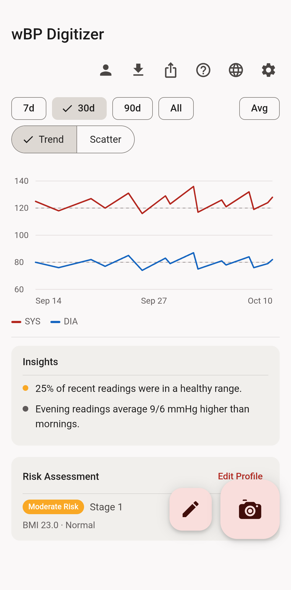
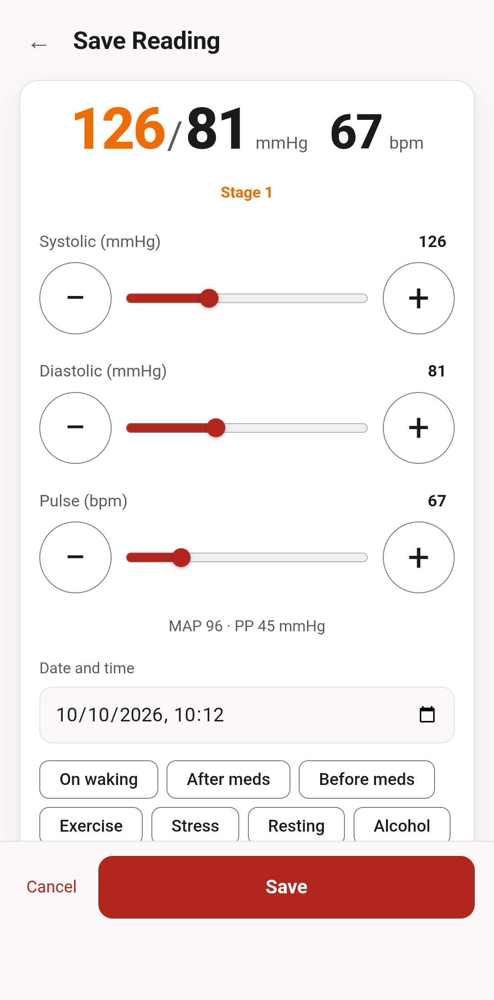
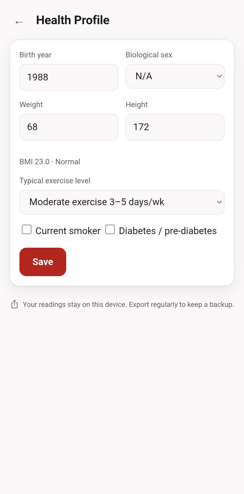

# wBP Digitizer — web

A local-first progressive web app for recording, charting and exporting blood
pressure readings. Readings live in the browser's IndexedDB. Camera recognition
runs locally in a browser worker; photos and readings are not uploaded.

## Screenshots

All readings and profile details shown below are synthetic demonstration data.

| Dashboard | Add a reading | Health profile |
| --- | --- | --- |
|  |  |  |

The app has no application backend, accounts, invitation codes, API keys or
usage quotas. Static HTTPS hosting is needed for installation and updates. Once
the service worker has cached the app, OCR runtime and models, normal use works
offline.

## Run locally

```sh
git clone https://github.com/zandaulion/bp-digitizer-web
cd bp-digitizer-web
python3 -m http.server -d web 8080
```

Open <http://127.0.0.1:8080/>. Camera capture in deployment requires HTTPS;
localhost is treated as a secure development context.

## GitHub Pages

Every push to `main` publishes the production artifact to
<https://zandaulion.github.io/bp-digitizer-web/>. The application uses
scope-relative asset, worker, manifest and service-worker URLs, so it works at
that project path as well as at the root of another static host.

The workflow under `.github/workflows/pages.yml` runs the same version-stamping
deployment used by the standalone server and publishes only the resulting
static `web/` artifact.

There is no compilation step. `deploy.sh` copies `web/` to `/var/www/bp` by default,
stamps a content-derived build version and versions module imports so an
installed PWA cannot mix old and new code.

```sh
./deploy.sh
# or
DEST=/another/static/root ./deploy.sh
```

## Local OCR

The camera reader is integrated from
[Hearth BP monitor OCR](https://github.com/zandaulion/hearth-bp-ocr) at source
revision `af4573d328006de1b599ef3c5690dfaaa0810cea`. It uses ONNX Runtime Web
1.30.0, a detector and a digit recognizer in a module worker. The matching
models, thresholds and runtime are shipped under `web/hearth/` and cached as a
single release. The experimental display-rectification fallback is a compact
browser port of the regression candidate documented upstream at revision
`941d4a36892938f3502d433db6b332d8c6c72dd4`.

The reader supports upright, common three-row SYS/DIA/pulse displays. It tries
the full image, conservative central crops and an adaptive lighting-normalized
crop. After those refuse an image, an experimental final pass may find and
perspective-correct a display outline. It returns a reading only when at least
two views agree and no plausible view disagrees, and every result recovered by
this pass is marked for review. A result is a candidate, a reading needing
extra review, or a refusal. The app always opens editable fields, requires the
user to confirm all three values against the monitor, and requires an explicit
save; it never guesses missing values or stores an OCR result automatically.

More than 90% precision on new real-world captures has not been established.
Every value must be checked against the monitor. Detection scores are not
calibrated correctness probabilities.

The two models total about 10.9 MB. The first online load downloads those models
and the WebAssembly runtime; later reads can run offline.

### OCR evaluation log

When explicitly enabled, the local evaluation log can summarize corrections by
SYS, DIA and pulse and show which inference stage produced each result. Photos,
predictions and corrections remain in the browser until the user exports or
deletes them.

Settings has an opt-in, device-local evaluation log for measuring OCR during a
trial. When enabled, it retains up to 100 resized, EXIF-stripped scan pictures,
the complete raw OCR result, and whether the values were changed before their
first save. Refused, discarded, retaken and failed scans are kept too.

The log is off by default, never uploaded, and deliberately excluded from the
encrypted readings backup. It can be inspected, exported as clear-text JSON
(including pictures), or deleted in Settings. Treat an exported log as
sensitive health data.

## On-device backup

The live database is browser storage, so clearing site data or uninstalling the
PWA can remove it. Settings therefore offers an encrypted backup file:

1. **Back up now** serializes readings and the profile.
2. The browser derives an AES-GCM key from the passphrase with PBKDF2-SHA-256
   (310,000 iterations).
3. It downloads a dated `.hbp` file. Neither the passphrase nor key is stored.
4. **Restore** decrypts a selected file locally and timestamp-deduplicates its
   readings before import.

Keep the passphrase separately; there is no account or server that can recover
it. A file in Downloads protects against cleared browser storage, but not loss
of the entire device. Users can copy the encrypted file to their own computer,
cloud drive or other storage without involving an application-operated server.

JSON, CSV and PDF exports remain available for interoperability. The `.hbp`
format is the privacy-preserving recovery format.

## Features

- Manual entry with sliders, numeric fields and accelerated press-and-hold steps
- Local camera OCR with editable candidate/review results and safe refusal
- Optional local OCR evaluation log with pictures and correction outcomes
- AHA zones, mean arterial pressure and pulse pressure
- Trend and SYS/DIA scatter charts over 7, 30, 90 days or all readings
- Optional burst averaging for chart display
- Tags, notes, profile metrics, BMI and cardiovascular risk estimates
- JSON/CSV import and export, printable and downloadable PDF reports
- Encrypted on-device backup and restore
- Twelve interface languages and RTL support for Arabic
- Offline installation and automatic service-worker update handling

The app does not provide medical diagnosis. Its calculations and OCR output are
informational and must not replace professional medical advice.

## Source layout

```text
web/
  app.js              views, charts, entry, local OCR flow and backup UI
  backup.js           portable PBKDF2/AES-GCM backup envelope
  db.js               IndexedDB readings and preferences
  bp.js               zones, MAP, BMI and risk calculations
  aggregate.js        burst averaging
  insights.js         dashboard observations
  ocr-audit.js         local OCR evaluation image and outcome helpers
  pdf.js              printable and rasterized PDF reports
  hearth/             local worker, models, ONNX runtime and notices
  i18n/               translated catalogues
  sw.js               offline shell and OCR asset cache
bin/
  version-imports.py  stamps the build hash into ES module imports
deploy.sh             static-file deployment
```

## Licensing

The original wBP Digitizer code is GPL-3.0. The integrated Hearth OCR source,
model weights and generated assets are AGPL-3.0-only and retain their notices in
`web/hearth/LICENSE` and `web/hearth/NOTICE`. ONNX Runtime retains its MIT
license and notices under `web/hearth/vendor/`.

See the upstream Hearth repository for model provenance, evaluation limitations,
training-data attribution and the complete integration documentation.
